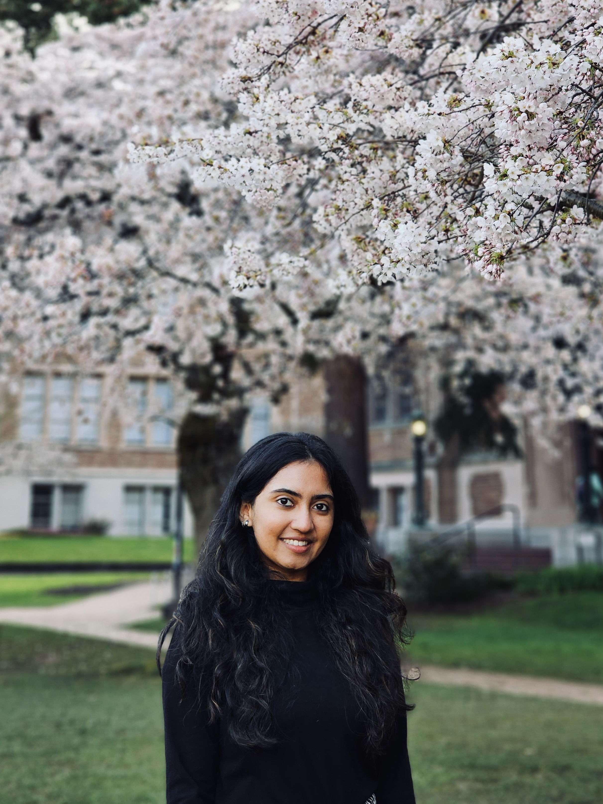

Hello!

* I'm a second year M.S. candidate at the department of Biostatistics concentrating in Statistical Genetics at <a href = "https://www.publichealth.columbia.edu"> Columbia University's Mailman School of Public Health. </a> Here, I've been affiliated with organizations like the Irving Center for Cancer Research through the Data Science Institute scholars program.

* Prior to this, I graduated with a dual degree (B.S.-M.S.) in Biological Sciences focused in Computational Biology at the <a href = "https://www.iitm.ac.in"> Indian Institute of Technology Madras</a>. I worked on my thesis with Dr. Himanshu Sinha as a part of <a href = "https://ibse.iitm.ac.in"> IBSE</a>, <a href = "https://rbcdsai.iitm.ac.in"> RBCDSAI </a> and the <a href = "https://home.iitm.ac.in/sinha/index.html"> Systems Genetics Lab </a>. 

* My research interest is at the intersection of Public Health and Functional Genomics using advanced computational methods. I have worked on projects and internships in the fields of Bioinformatics, Health Informatics, Cancer Genomics and Biostatistics. 

* In the future, I hope to utilize my diverse experiences and contribute to the field of precision medicine.

* When I'm not busy with my coursework, I enjoy playing the violin, photography, swimming and inventing new desserts!

